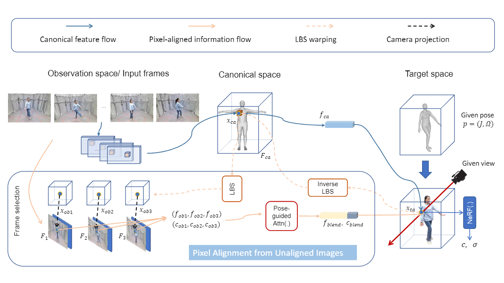

# **GeneHumanNeRF: Animatable and Generalizable Human NeRF from Monocular Videos**

## Introduction  
We built a new generalizable and animatable method that takes a few monocular video frames as input, which is like an extension of HumanNeRF from the setting of per-scene trained into one-shot trained. 

**Codes are coming soon, please stay tuned...**

<!-- ## 2. Create Environment  

## 3. Quick demo  

## 4. Directory  

## 5. Training GeneHumanNeRF

## 5. Testing GeneHumanNeRF -->

### Acknowledgement

This repo is mainly based on [HumanNeRF](https://github.com/chungyiweng/humannerf) and [AniNeRF](https://github.com/zju3dv/animatable_nerf). Thanks for their well-structured codebase.
